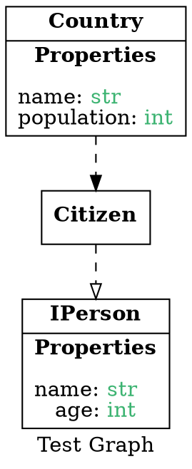

# PyViz
A framework for designing python tools using UML and graphviz.

# Requirements
In order to render diagrams, you must have [Graphviz](https://graphviz.org/) >= 2.40.1 installed. If you only wish to use this library to generate .dot files, there is no need to install any external dependencies. You can install [Graphviz](https://graphviz.org/) by visiting https://graphviz.org/download/ or by running:
```bash
apt-get update -y && apt-get install -y graphviz || yum install -y graphviz || dnf install -y graphviz || brew install -y graphviz
```


# Example
The following code can be used to generate a .dot file compatible with [Graphviz](https://graphviz.org/). Use [Graphviz](https://graphviz.org/) to render diagrams into several formats from a .dot file.

## Diagram


## Code
```python3
from pyviz import uml, Graph

Country = uml.UMLClass(
    "Country", properties=[uml.UMLProperty("name", "str"), uml.UMLProperty("population", "int")]
)
IPerson = uml.UMLClass(
    "IPerson", properties=[uml.UMLProperty("name", "str"), uml.UMLProperty("age", "int")]
)
Citizen = uml.UMLClass("Citizen", properties=[])

Citizen.implements(IPerson)
Country.depends_on(Citizen)

g = Graph(label="Test Graph")
g.add_nodes([Country, IPerson, Citizen])

print(g.render())
```
## Generated Dot File

